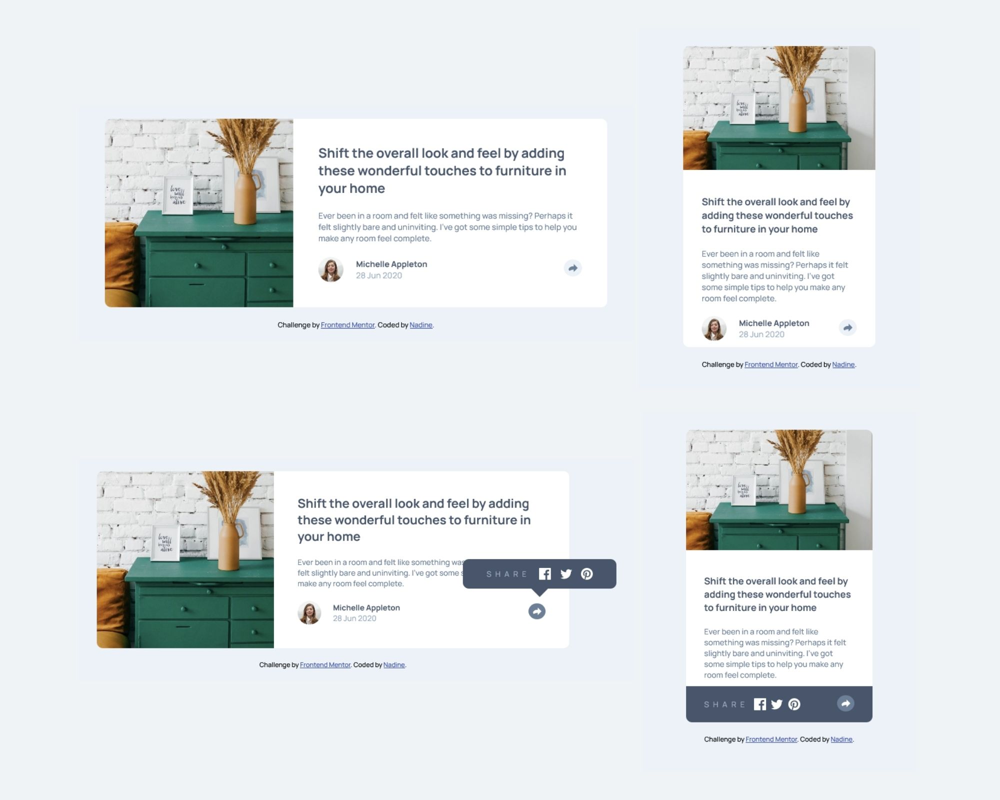

# Frontend Mentor - Article preview component solution

This is a solution to the [Article preview component challenge on Frontend Mentor](https://www.frontendmentor.io/challenges/article-preview-component-dYBN_pYFT). Frontend Mentor challenges help you improve your coding skills by building realistic projects. 

## Table of contents

- [Overview](#overview)
  - [The challenge](#the-challenge)
  - [Screenshot](#screenshot)
  - [Links](#links)
- [My process](#my-process)
  - [Built with](#built-with)
  - [What I learned](#what-i-learned)
  - [Continued development](#continued-development)
- [Author](#author)

## Overview

### The challenge

Users should be able to:

- View the optimal layout for the component depending on their device's screen size
- See the social media share links when they click the share icon

### Screenshot

### Links

- Solution URL: [https://github.com/nadlgit/article-preview-component-master/](https://github.com/nadlgit/article-preview-component-master/)
- Live Site URL: [https://nadlgit.github.io/article-preview-component-master/](https://nadlgit.github.io/article-preview-component-master/)

## My process

### Built with

- Mobile-first workflow
- Vanilla CSS
- CSS grids

### What I learned

My main learning is CSS grids, and I love them. My first attempt to solve this challenge was without them, and it was a nightmare that I didn't finished.

I also learned how to make a bubble (for the social media share icons).

And is was a good exercise to handle responsive design.

### Continued development

- I don't have enough time now, but I would like to see if it can be achieved using less absolute length units.
- It could be enhanced with CSS animations.
- Another point is that I still don't understand how to center vertically the component on screen.
- Also I would like to explore SVG manipulations.

## Author

- Frontend Mentor - [@nadlgit](https://www.frontendmentor.io/profile/nadlgit)
